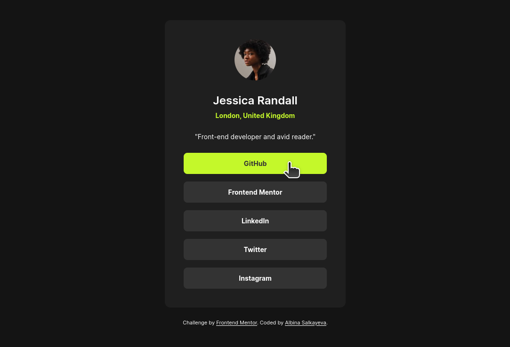
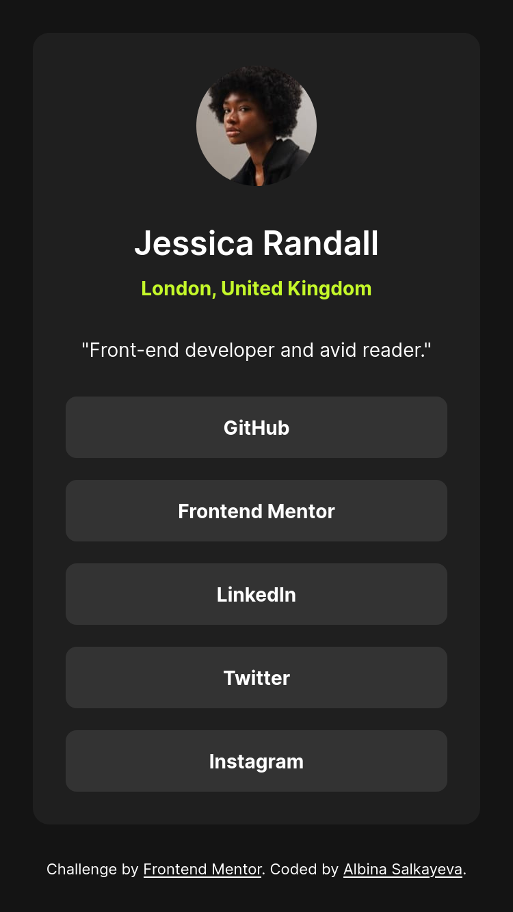

# Frontend Mentor - Social links profile solution

This is a solution to the [Social links profile challenge on Frontend Mentor](https://www.frontendmentor.io/challenges/social-links-profile-UG32l9m6dQ). Frontend Mentor challenges help you improve your coding skills by building realistic projects. 

## Table of contents

- [Overview](#overview)
  - [The challenge](#the-challenge)
  - [Screenshots](#screenshots)
  - [Links](#links)
- [My process](#my-process)
  - [Built with](#built-with)
  - [What I learned](#what-i-learned)
  - [Useful resources](#useful-resources)
- [Author](#author)

## Overview

### The challenge

Users should be able to:

- See hover and focus states for all interactive elements on the page

### Screenshots

| Desktop | Mobile |
|-|-|
|  |  |

### Links

- Solution URL: [https://github.com/albina0104/social-links-profile](https://github.com/albina0104/social-links-profile)
- Live Site URL: [https://albina0104.github.io/social-links-profile/](https://albina0104.github.io/social-links-profile/)

## My process

### Built with

- Semantic HTML5 markup
- CSS custom properties

### What I learned

- `<nav>` HTML element can be used for a set of navigational links.
- I converted all `px` sizes to `rem`, but somehow my result did not match the design. Turned out, the reason was that I set a root font size as 14px. I did it only to set the default font size for the text, without thinking that it would affect sizes of everything since it's all in `rem`. So I removed the root font size, and set font size only for the elements that need it.

### Useful resources

- [`<nav>`: The Navigation Section element - MDN](https://developer.mozilla.org/en-US/docs/Web/HTML/Reference/Elements/nav)

## Author

- Frontend Mentor - [@albina0104](https://www.frontendmentor.io/profile/albina0104)
- GitHub - [albina0104](https://github.com/albina0104)
